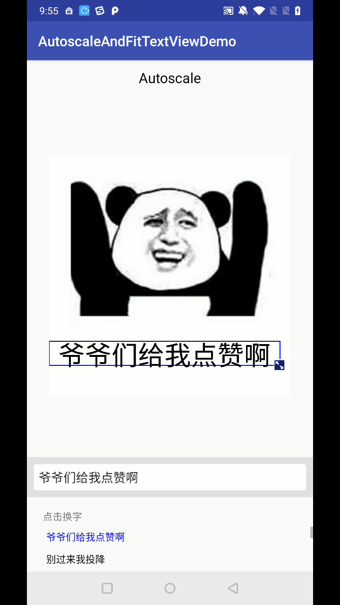

# AutoscaleAndFitTextView
能实现文本跟随手势移动自动调整大小和每行长度的TextView

效果如下



## 使用方法：

将该布局放置在图片布局上，并设置背景图片的宽高
```java

        autoScaleFitTextView = (AutoScaleAndFitTextView) findViewById(R.id.diy_dg_view);
        autoScaleFitTextView.setParentViewSize(
            ViewUtil.getViewWidth(ivTempGif),
             ViewUtil.getViewHeight(ivTempGif));


```

调用更新文字方法就会自动调整宽高和大小
```java
autoScaleFitTextView.setDisplayText(text);
```
2018年11月26日11:13:06